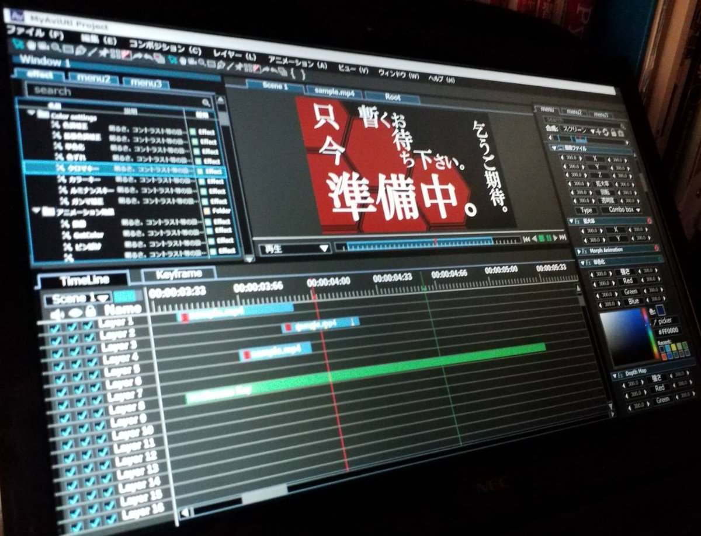
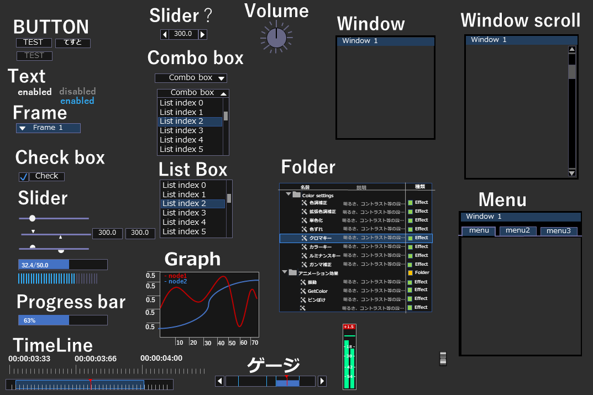
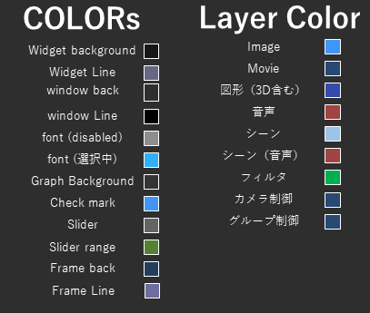

 
 
 

# Introduction 設計思想





## 使い方
+ Immediate Modeではなく、CreateWidget()関数などでウィジェットを作成。
+ 複数Window対応（Docking Panel機能付き）
+ Callback処理あり
+ 通常はWidget作成時にWidgetが操る変数のポインタを指定して、その値をいじる。（ここでイベント発生）
+ OpenGLのversion = ?? //TODO
+ GLSLのversion = ?? //TODO


## 標準Widget


|Widget名|種類|説明|
| ---- | ---- | ---- |
|Text|通常、色付き|背景が特に何もないただのテキスト。イベントなどは発生しない|
|ボタン|文字のみ, 画像のみ, 画像＆文字|動作としては二種類あり、押されるとbool変数をトグルするものと、押されるとイベントループを発生しそこで何らかの処理をするものがある。|
|Image|GLBitmap、cv::Mat、ファイル名|画像を表示する|
|ラジオボタン|文字のみ、画像のみ、画像＆文字|横に並べるか縦に並べるかは画面の大きさをもとに判断。|
|チェックボックス|文字、画像、文字＆画像|チェックボックス|
|リストボックス|複数選択あり/なし|文字が長くなると「...」で省略する|
|コンボボックス|なし|文字が長くなると「...」で省略する|
|スライダー|以下、全てVertical/Horizontalあり。通常、2Value、数値表示あり、塗りつぶしあり、塗りつぶし線||
|数値調整|左右矢印付き/なし|スライダーの棒がなくなったやつ。マウスを左右にドラッグして数値調整を行う|
|つまみ|メモリあり/なし、複数回転あり/なし　の4種類||
|Edit box|一行、複数行||
|Search|なし|検索を行う。（嘆息アルゴリズムは自前で書くとして、Search Widgetが果たす役割は入力されたテキストをイベント処理でメイン処理に伝えるのみ）|
|Progress Bar|なし|プログレスバー|
|グラフ|メモリあり/なし||
|Color Picker|alphaあり/なし|上図参照|


## Styles

### Window
|変数名|値（float）|説明|
| ---- | ---- | ---- |
|Alpha|1.0f|不透明|
|WindowPadding_x|8|ウィンドウ内のPadding|
|WindowPadding_y|8|ウィンドウ内のPadding|
|WindowBorderSize|1.0f|Thickness of border around windows. Generally set to 0.0f or 1.0f.|
|WindowMinSize_x|32|Minimum window size|
|WindowMinSize_y|32|Minimum window size|
|WindowTitleAlign_x|0.0f|Alignment for title bar text|
|WindowTitleAlign_y|0.0f|Alignment for title bar text|
|WindowMenuButtonPosition|LEFT|メニューバーの配置（LEFT/RIGHT/CENTER）|
|ScrollbarWidth|14.0f|Width of the vertical scrollbar, Height of the horizontal scrollbar|
|ScrollbarRounding|9.0f|Radius of grab corners rounding for scrollbar|


### Widgets
|変数名|値（float）|説明|
| ---- | ---- | ---- |
|FramePadding_x|4|Padding within a framed rectangle (used by most widgets)|
|FramePadding_y|3|Padding within a framed rectangle (used by most widgets)|
|FrameBorderSize|0.0f|Thickness of border around frames. Generally set to 0.0f or 1.0f. |
|ItemSpace_x|8|Horizontal spacing between widgets/lines|
|ItemSpace_y|4|Vertical spacing between widgets/lines|
|ItemInnerSpace_x|4|ウィジェット内の図形の間のspacing(e.g. a slider and its label)|
|ItemInnerSpace_y|4|ウィジェット内の図形の間のspacing (e.g. a slider and its label)|
|WidgetTextAlign|LEFT|Widget内のテキスト位置|
|ButtonTextAlign_x|0.5f|Alignment of button text when button is larger than text.|
|ButtonTextAlign_y|0.5f|Alignment of button text when button is larger than text.|
|IndentSpacing|21.0f|Horizontal spacing when e.g. entering a tree node. Generally == (FontSize + FramePadding.x * 2).|
|ColumnsMinSpacing|6.0f|Minimum horizontal spacing between two columns. Preferably > (FramePadding.x + 1).|


### その他
|変数名|値（float）|説明|
| ---- | ---- | ---- |
|PopupBorderSize|1.0f|Thickness of border around popup or tooltip windows. Generally set to 0.0f or 1.0f|
|MouseCursorScale|1.0f|scale software rendered mouse cursor|
|WidgetFontSize|14|ウィジェット内のfont size|
|WindowFontSize|14|Windowのタイトルバー、メニューバーなどのFont size|
|FontName|0|0 = メイリオ,　1=Meiryo UI, 2=MS UI Gothic, 3=Yu Gothic UI|


## Color settings

|変数名|値（dark）|値（light)|値（classic)|説明|
| ---- | ---- | ---- | ---- | ---- |
|Col_Text|||||
|Col_TextDisabled|||||
|Col_TextDisabledWidget|||||
|Col_TextHovered|||||
|Col_TextNoEmphasize|||||
|Col_WndBg|||||
|Col_wndLine|||||
|Col_wndScroll|||||
|Col_wndScrollBg|||||
|Col_FrameBg|||||
|Col_FrameLine||||
|Col_PopupBg|||||
|Col_PopupLine|||||

|変数名|値（dark）|値（light)|値（classic)|説明|
| ---- | ---- | ---- | ---- | ---- |
|Col_WidgetBg|||||
|Col_WidgetBg1|||||
|Col_WidgetBg2|||||
|Col_WidgetBg3|||||
|Col_WidgetBgHover|||||
|Col_WidgetBgSelected|||||
|Col_WidgetBgDisabled|||||
|Col_WidgetBgMain|||||
|Col_WidgetLineMain|||||
|Col_WidgetLine1|||||
|Col_WidgetLine2|||||
|Col_WidgetLineHover|||||
|Col_WidgetLineSelected|||||
|Col_WidgetLineDisabled|||||


# 構造
こんな感じ↓
```
App MAIN loop
├── window 1
├── window 2
│   ├── panel 1 
│   └── panel 2
│        ├─  widget  1
│        └─  widget  2
└── child window 3
```

- (描画時) : main処理 -(window一覧が呼び出される)- > Window -(panel一覧が呼び出される)- > Panel --> Widget, child_panel
- (イベント発生時)：main処理 -(windowの値が読み込まれる) -->Window -->  panel(x,y座標から計算)  --> Widget, child_panel


# How does it works ? 

<b> Init処理 / WM_CREATE / WM_SIZE など、全ての描画をやり直す場合</b>
各Widget{
+  ウィジェット生成が呼ばれる
+ getCurWindow()からウィンドウのCommandListにレンダーコマンドを追加
}


<b> WndProcからの呼び出し（ボタンが押された/スライダーの値更新etc.）</b>
→つまり、一つor一定のWidgetのみの話なので、そこの部分のみ更新する。
+ for文でisContains()を回して、該当するWidgetを探す
+ そこからそのウィジェットのみCommandListにレンダーコマンドを追加して
+ 描画

→Overlay描画もここで行う


<b> システム（ユーザープログラム）からの呼び出し</b>
++ 表示するべき値が内部で更新される
++ ユーザーでWindow.frame.widget.setRenderCommand()を実行する

Frameのサイズ変更・スクロール


# AviUtlの場合のお話
Windowは
- main(編集ウィンドウ)
- sub(音量表示用、カラー波形スコープ、png保存などのサブ機能提供用、設定Window)
の2つが通常使用時。
使い方によってはmainウィンドウも複数に分けることができるようにする


例えば、新しくエフェクトを追加した場合：


# ソースコード集


## common

### uiVector
```cpp
//TODO: 
```


```cpp
// Effectの情報を格納している構造体。
struct FxInfo{
	short effect_id; // Effect固有のID これで識別する
	char effect_name[20]; //Effect名
	char description[200]; //コメント
	std::vector<char *> track_names; //トラックバーの数値の意味を表す
	std::vector<std::vector<int> > track_data; //{{type, min, max, delta}, {...}...} 
	std::vector<float> default_data;
	
};
```

```cpp

```

## rendering
レンダリングと言っても描画するものは画像、テキスト、図形（塗りつぶし）の3種類

### DrawList
```cpp
struct uiDrawList{
	uiVector<float> poly_vertex_array;
	uiVector<float> poly_col_array;
    uiVector<float> texture_vertex_array;
    uiVector<float> cord_array;
    uiVector<Vector5d> sciccor; //siccor = (x, y, width, height, use=1 or not=0) の要素数5の配列
	uiVector<int>   draw_orders;  
	// (draw_order,   index,      vertex_num ) 　<- Polygon描画の時
	// (DRAW_IMAGE,   index,      texture_num)   <- Texture描画の時
	//　(DRAW_TEXT,   pos_index, string_index)  <- 文字描画の時
	//  (SET_SCISSOR, scissor_index, ??) <- glScissorをセット
	//draw_order = (GL_LINE_LOOP, GL_LINES, GL_TRIANGLES, GL_TRIANGLE_STRIP, GL_TRIANGLE_FAN, 
	//              DRAW_IMAGE, DRAW_TEXT, DRAW_TEXT_DISABLED, DRAW_TEXT_, SET_SCISSOR)
	
	uiVector<int>   text_pos_x;
	uiVector<int>   text_pos_y;
	uiVector<WChAR *> text_list;
	
	int poly_num; //描画する図形データの数
	int fig_num;  //描画する画像データの数

};

//標準関数として
AddRectangle(x,y,width,height);
//等を用意する
```

+ 複数モニタに対応するため、uiDrawListをまとめる構造体を作る（GLFWwindow一つにつき、DrawListが一つ。VBOとかそこらへんのしょりがめんどうになるため）
+ 


### Textures

```cpp
struct textures{
	uiVector<GLint> UserTextures;
    
    GLint uiIconTexture; //標準アイコンのテクスチャ
    uiVector<float> getTextureIndex(WCHAR *moji); //標準のアイコンを描画する時のTextureCoordinateを返す
};
```


# ini File Parser
設定ファイルをiniファイルで読み込み/書き込むとき、iniパーサーが必要になる。

## iniファイルに書き込むもの
+ Window Style 
+ Window Color (dark, light, classic,  HighContrastDark)
+ Workspace
+ 最近使用したフォルダ
+ 最近使用した色
+ デフォルトの設定
+ バージョン情報

## ini sample text
iniファイルは以下のようなもの
```cpp
[workspace]


[style]
type=sample      
data_dir=C:   // 画像などの相対ディレクトリ
width=1920     // 画面サイズ
height=1080       

[color:dark]
Col_WidgetBg=255,255,255
Col_WidgetBg2=100,255,10
.......
```

追加設定↓

+ カンマで値を区切ることができる。
+ [header]の中を「-」で区切ることで階層化
+ //以下の行はコメント
+ 文字は「""」でくくる（くくったら、その中に//や改行が入っていても無視する）


### AviUtlのexoの文字コードについて
+ 一文字につき4桁ずつでUnicodeを使用（16進数）
+ 4桁のうち上二けたと下二桁は入れ替わっている。
+ 改行については不明

```cpp
a=6100
b=6200
c=6300
A=4100
E=4500
z=7a00
+=2b00
!=21000000 63000d000a003000310032003300000000
 （半角スペース）=20000000 63000d000a003000310032003300000000
0=3000
1=3100
2=3200
3=3300
abcn123=6100 6200 63000 d000a00 3000 3100 3200 3300 00000000000000
あ=42300000 63000d000a0030003100320033000000
あ=4230
    
```

exoファイル書き出し？のPythonスクリプト
Reference -> https://pandanote.info/?p=2422
```python

#!/usr/bin/env python3

# -*- coding: utf-8 -*-

import io
import sys
import re
import codecs
from struct import *
from binascii import hexlify


# 標準出力の文字コードを変更する。
sys.stdout = io.TextIOWrapper(sys.stdout.buffer,encoding='cp932')


if len(sys.argv) <= 2:
    print("Usage: txt2exo.py <template file> <text file>")
    sys.exit(1)

templatefile = sys.argv[1]
textfile = sys.argv[2]
exedit = {}
zero = {}
# 現在のセクションの文字列をそのまま入れます。
currentsection = "exedit"
originalstart = 0
originalend = 0
sectionsnum = 0

with open(templatefile,mode='r',encoding='shift_jis') as f:
    for line in f:
        m = re.match(r'\[([^\]]+)',line)
        if m:
            if m.group(1) != "exedit":
                currentsection = m.group(1)
                mm = re.match(r'^\d+$',m.group(1))
                if mm:
                    sectionsnum = int(currentsection)

        elif re.match(r'[^\r\n\s]',line):
            kv = line.split('=',1)
            if currentsection == "exedit":
                exedit[kv[0]] = kv[1]
            else:
                if currentsection not in zero:
                    zero[currentsection] = {}
                zero[currentsection][kv[0]] = kv[1]
                if kv[0] == 'start':
                    if (currentsection == 0):
                        originalstart = int(kv[1])
                elif kv[0] == 'end':
                    originalend = int(kv[1])

texts = [line.rstrip('\n').rstrip('\r') for line in open(textfile,"r",encoding="UTF-8") if re.match(r'^[^\r\n]',line)]

print("[exedit]")
for k,v in exedit.items():
    print("{0:s}={1:s}".format(k,v),end="")


sectionsnum = sectionsnum + 1
sectioncount = 0
deltaframes = originalend-originalstart
startpos = originalstart
currentsection = 0


for text in texts:
    for k,v in zero.items():
        m = re.match(r'^\d+$',k)
        if m:
            currentsection = sectioncount+int(k)
            print("[{0:d}]".format(currentsection))
            for vk,vv in v.items():
                if vk == "start":
                    print("{0:s}={1:d}".format(vk,startpos+int(vv)))
                elif vk == "end":
                    print("{0:s}={1:d}".format(vk,startpos+int(vv)))
                else:
                    print("{0:s}={1:s}".format(vk,vv),end="")
        else:
            sectionname = re.sub(r'^\d+',str(currentsection),k)
            print("[{0:s}]".format(sectionname))

            for vk,vv in v.items():
                if vk == "text":
                    text_in_utf16 = hexlify(text.encode('utf-16'))
                    hex_str = text_in_utf16.decode("ascii")[4:]
                    print("text={0:s}".format(hex_str),end="")
                    for x in range(len(hex_str),4096,4):
                        print("0000",end="")
                    print("")
                else:
                    print("{0:s}={1:s}".format(vk,vv),end="")
    sectioncount = sectioncount + sectionsnum
    startpos = startpos + deltaframes
```


​    